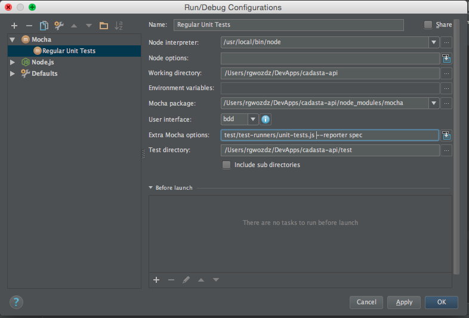
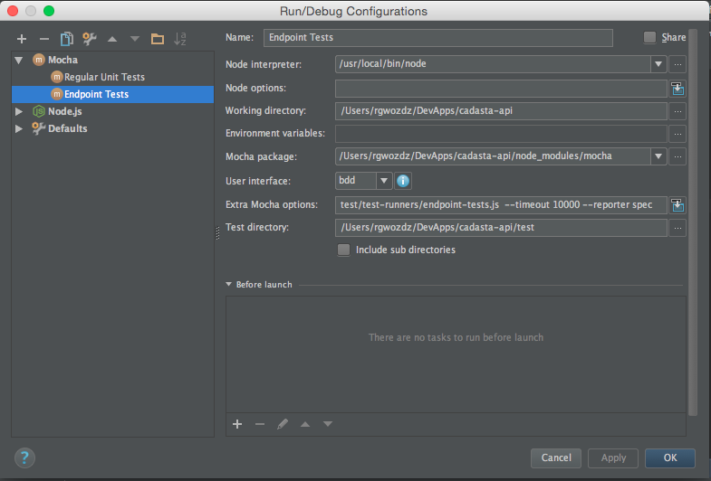
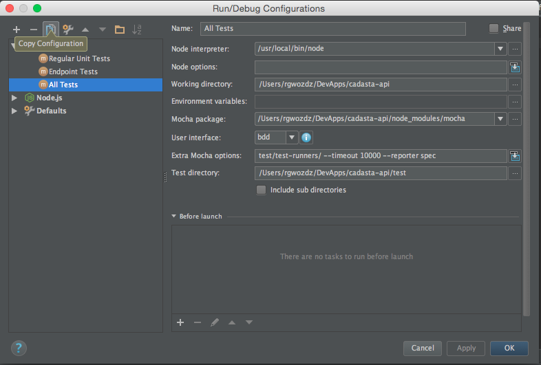

##Testing

We use the Mocha test framework along with the Chai BDD / TDD assertion library, along with some additional Chai plugins: Chai Things for assertions on array elements and Chai Http for HTTP request/response assertions.  
  
**Tests are organized into two separate categories: 1) regular unit-tests, and 2) endpoint tests.**  
 Regular unit-tests would include simple functions, like utilites. Endpoint tests, however, are a special case and are better described as "integration" test.  To test an endpoint, you need to do more than execute a single functional unit and test results; rather, the API server must be running and connected to a test database, and the test specification must have access to that API.

###Unit Tests
#####Authoring
If you want to author tests for simple functions create spec files in the [/test/unitSpecs](/test/unitSpecs) directory and follow the patterns described by [Mocha](https://mochajs.org/#assertions) and or [Chai](http://chaijs.com/).

#####Running via terminal

All tests:  
      
    mocha test/test-runners/unit-tests.js  --reporter spec  

Specific Test(s): 

    mocha test/test-runners/unit-tests.js  --testFiles exampleSpec.js --reporter spec  

Note the option "testFiles".  You can provide it a comma-delimited-list of files from  the unitSpecs directory to test (no spaces, e.g., `spec1.js,spec2.js,spec3.js`).  

#####Running via Webstorm (allows for breakpoints, etc)
 
1) In Webstorm create a new Mocha "Edit Configuration" and provide the following Extra Mocha options:

2) Start the debugger for this configuration.  
  
###Endpoint Tests
#####Authoring
If you want to author tests for endpoints, create spec files in the [/test/endpointSpecs](/test/endpointSpecs) directory.  The pattern here is slightly different due to the need for the test to have access to the running Express server.  Each test spec needs to be wrapped in a `modules.export` function with an `app` parameter.  Within this function, you can follow the patterns described by [Chai-Http](http://chaijs.com/plugins/chai-http):

	var chai = require('chai');
	var chaiHttp = require('chai-http');
	chai.use(chaiHttp);
	
	module.exports = function(app) {
	
	    describe('Example endpoint suite', function () {
	        describe('GET /parcel', function () {
	            it('should have status 200', function () {
	
	                chai.request(app)
	                    .get('/parcel')
	                    .then(function (res) {
	                        expect(res).to.have.status(200);
	                    })
	                    .catch(function (err) {
	                        throw err;
	                    })
	
	            });
	        });
	    });
	
	};

#####Running via terminal  

All tests:  
      
    mocha test/test-runners/endpoint-tests.js  --reporter spec

Specific Test(s): 

    mocha test/test-runners/endpoint-tests.js  --testFiles exampleEndpointSpec.js --reporter spec  

Note the option "testFiles".  You can provide it a comma-delimited-list of files from  the unitSpecs directory to test (no spaces, e.g., `spec1.js,spec2.js,spec3.js`).
    
#####Running via Webstorm (allows for breakpoints, etc)
 
1) In Webstorm create a new Mocha "Edit Configuration" and provide the following Extra Mocha options:

2) Start the debugger for this configuration.   
  
### Running all tests, unit and endpoint

Via terminal:  

    mocha test/test-runners  --timeout 10000 --reporter spec
    
Via webstorm:
1) In Webstorm create a new Mocha "Edit Configuration" and provide the following Extra Mocha options:

2) Start the debugger for this configuration.   